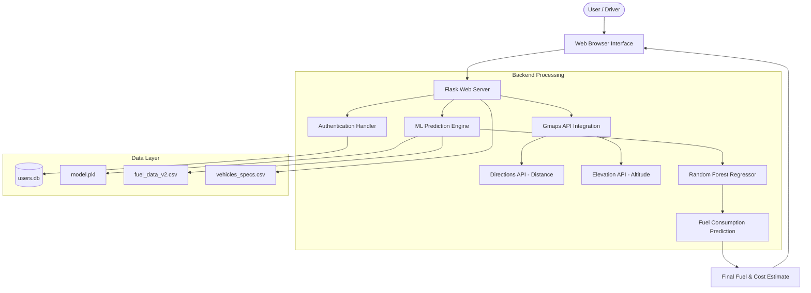
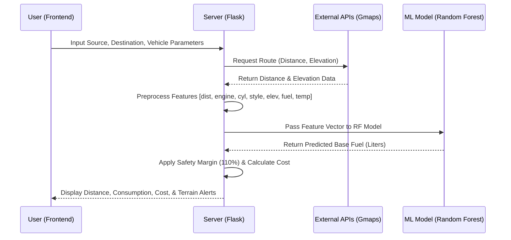
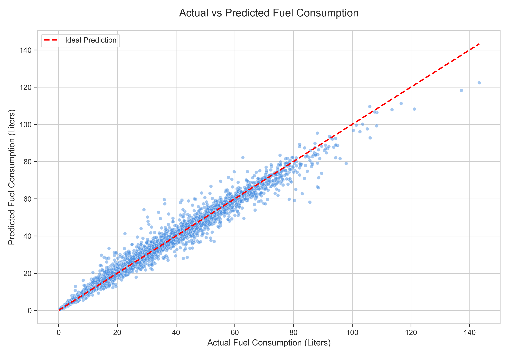

# FuelMate – Technical Reference Documentation

This document provides a technical overview of the **FuelMate – Smart Fuel Predictor** project, including system architecture, application workflow, and machine learning model performance evaluation.

---

## 1. System Architecture

The architecture follows a modular design, integrating a Flask-based web server with external geospatial APIs and a machine learning inference engine.

---

## 2. Methodology & Flow

The application logic handles real-time data retrieval and processing to provide high-fidelity fuel estimates.

### Workflow Diagram

### Key Components:
- **Feature Engineering**: Incorporates static vehicle specs with dynamic variables (Driving style, Terrain elevation, Ambient temperature).
- **External Integration**: Uses Google Maps Directions and Elevation APIs to calculate precise road distance and altitude changes.
- **Safety Logic**: Estimates a "Safe Fuel" requirement by adding a 10% overhead to the ML prediction to account for traffic or unexpected idling.

---

## 3. Model Performance Evaluation

A **Random Forest Regressor** with 150 independent estimators was used to model the complex multi-variable relationships. The model was evaluated against a synthetic large-scale dataset (`fuel_data_v2.csv`) comprising 5,000 diverse trip scenarios.

### Performance Metrics:
| Metric | Value |
| :--- | :--- |
| **Mean Absolute Error (MAE)** | 1.8187 Liters |
| **Mean Squared Error (MSE)** | 9.4234 Liters² |
| **Coefficient of Determination (R²)** | 0.9770 |

### Prediction Analysis (Actual vs. Predicted)
The scatter plot below illustrates the high correlation between actual fuel consumption and model predictions, demonstrating the model's reliability across various trip lengths and vehicle types.

---

## 4. Conclusion
The high R² score of **0.977** indicates that the model explains over 97% of the variance in fuel consumption, making it a robust predictive tool for both personal and enterprise fuel management.
